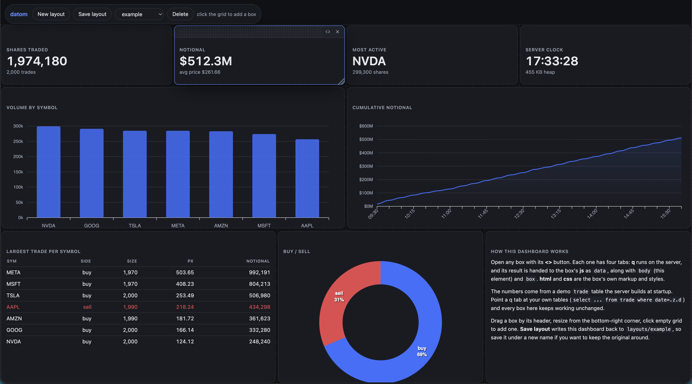

Each layout is a seperate webpage. They persist on disk. Each boxhas it's own css, js, html that you can configure in the browser.
Drag and position the boxes etc. 

## Running

```
q datom_server.q      # from the repo root -- PROJ_ROOT is taken from the cwd
```

Then open http://localhost:5002/datom.html

Pick **example** from the dropdown to load the dashboard that ships with the repo.
Otherwise you get a blank grid: click anywhere on it to drop a box, drag it by its
header, resize from the bottom-right corner, and open the code editor from the `<>`
button. Boxes are positioned as CSS grid areas, so a saved layout restores exactly
where you left it.

## The example dashboard

`layouts/example` is a nine-box dashboard checked into the repo, so there is
something real to read and pull apart before writing your own. It covers the
patterns you are likely to want:

| box | what it shows |
|---|---|
| four stat tiles | an atom and a dict from q, formatted into a headline number |
| volume by symbol | a `by` aggregate as an ApexCharts bar chart |
| cumulative notional | a time series, with `xbar` buckets and a running `sums` |
| largest trade per symbol | a table built from whatever columns the q returned |
| buy / sell | a donut, and how to colour a chart from the page's own CSS variables |
| how this works | plain html and css, no q at all |

It runs against a demo `trade` table (2000 rows, seven symbols) that the server
builds at startup — see the top of `datom_server.q`. It is only defined if you do
not already have a `trade`, so a real one loaded from `db/` wins. Point any box's
q tab at your own tables and the rest of the dashboard keeps working.

**Save layout** writes back to `layouts/example`, so save under a new name first
if you want to keep the original around.

## Layouts

A layout is a directory under `layouts/` named after the dashboard, so the name
you give it is its id. The dropdown always shows the layout currently being
served, which drives what **Save layout** does:

| dropdown | Save layout | Delete |
|---|---|---|
| `Empty layout` | asks for a name, creates it, and you are now editing it | disabled |
| a saved layout | **rewrites that layout in place** | removes it from disk |

So the loop is: build on the blank canvas, save once to name the layout, then keep
saving to update it. Pick `Empty layout` (or **New layout**) to start a fresh one.
Names become directory names, so anything outside `A-Za-z0-9_-` becomes a dash.

Each layout keeps its own copy of the html/js/css alongside its `userfiles/`, so
old layouts keep working after the app changes. That copy is made the first time a
layout is served and never refreshed, which is why `layouts/example` can live in
git as nothing but its `userfiles/` — the app files are filled in on first use and
stay gitignored.

There is no index file to keep in step: the layout list *is* the directory listing.
`db/` and every layout but the example are generated at runtime and gitignored.

ace and apexcharts load from a CDN, so the first run needs a network connection.

## The Q tab

Each box has four buffers: **html**, **css**, **js** and **q**. On every render the
box's q runs on the server (`.req.runQ`, plain `value`), and the result is handed
to the box's js:

```js
// your js runs with three things in scope
data   // whatever the q returned, as JSON
body   // your content element -- what the html tab fills. Scope selectors to this.
box    // the whole box, header and all. For box.id, or state like box.__timer.
```

Use `body`, not `box`, to find your own markup. `box` also contains the header
and its buttons, so `box.querySelector('div')` matches the **drag bar** rather
than your content — it binds happily and then does nothing where you click.

`.j.j` does the encoding, so shapes map the way you'd expect. A `by` clause is
unkeyed for you:

| q | `data` in js |
|---|---|
| `sum 1240 860 2105` | `4205` |
| `` `a`b!1 2 `` | `{a: 1, b: 2}` |
| `([]sym:`AAPL`MSFT; size:1240 860)` | `[{sym:"AAPL",size:1240}, {sym:"MSFT",size:860}]` |
| `select sum size by sym from trade` | `[{sym:"AAPL",size:400}, …]` |
| `2026.08.01+til 3` | `["2026-08-01","2026-08-02","2026-08-03"]` |
| `.z.p` | `"2026-08-06T14:48:09.914527000"` |

Multi-line q, comments and blank lines all work. If the q errors, the message is
shown in the box and the js is skipped.

A new box starts with a little markup in its html tab and the three bindings
above as a comment in its js tab, so there is always something on screen and
something for a selector to find. Clear them if you want a blank box — but note
that `body.querySelector(...)` returns `null` when the html tab is empty, which
is what "Cannot read properties of null" means.

### Examples

Each example lists every buffer it needs. If an example shows an `html` line,
that markup has to be in the html tab — the js looks for it. The table and chart
examples below build their own markup, so their html tab can be left empty.

**Stat tile** — q returns an atom.

```
q     sum 1240 860 2105 430
html  <div class="stat"><div class="v">-</div><div class="k">total volume</div></div>
js    body.querySelector('.v').textContent = data.toLocaleString()
```

**Table** — builds its own markup, so the html tab can stay empty and it works
for *any* q table without editing the headers.

```
q     select sym, size, px from ([]sym:`AAPL`MSFT`NVDA; size:1240 860 2105; px:214.3 402.1 121.9)
css   table{width:100%;border-collapse:collapse;font-size:13px}
      th{text-align:left;font-weight:600;opacity:.55;font-size:11px;text-transform:uppercase;padding-bottom:6px}
      td{padding:5px 0;border-top:1px solid #8882;font-variant-numeric:tabular-nums}
      td+td,th+th{text-align:right}
js    if (!data || !data.length) { body.innerHTML = '<p>no rows</p>'; }
      else {
        const cols = Object.keys(data[0]);
        const cell = v => typeof v === 'number' ? v.toLocaleString() : v;
        body.innerHTML =
          '<table><thead><tr>' + cols.map(c => `<th>${c}</th>`).join('') + '</tr></thead><tbody>' +
          data.map(r => '<tr>' + cols.map(c => `<td>${cell(r[c])}</td>`).join('') + '</tr>').join('') +
          '</tbody></table>';
      }
```

**Grouped aggregate → bar chart** — the `by` result arrives as an array of rows.

```
q     select sum size by sym from ([]sym:`AAPL`MSFT`AAPL`NVDA; size:100 200 300 400)
js    body.replaceChildren(Object.assign(document.createElement('div'), {style:'height:100%'}));
      new ApexCharts(body.firstChild, {
        chart:{type:'bar', height:'100%', toolbar:{show:false}, animations:{enabled:false},
               background:'transparent', foreColor:'#9aa1ad'},
        colors:['#3b6fff'], dataLabels:{enabled:false}, grid:{borderColor:'#8883'},
        series:[{name:'size', data:data.map(r => r.size)}],
        xaxis:{categories:data.map(r => r.sym)}
      }).render()
```

**Time series → area chart** — dates encode as `"YYYY-MM-DD"` strings, so they
drop straight into `categories`.

```
q     ([]d:2026.08.01+til 20; v:20+20?80)
js    body.replaceChildren(Object.assign(document.createElement('div'), {style:'height:100%'}));
      new ApexCharts(body.firstChild, {
        chart:{type:'area', height:'100%', toolbar:{show:false}, animations:{enabled:false},
               background:'transparent', foreColor:'#9aa1ad'},
        colors:['#3b6fff'], dataLabels:{enabled:false}, stroke:{curve:'smooth', width:2},
        grid:{borderColor:'#8883'},
        series:[{name:'v', data:data.map(r => r.v)}],
        xaxis:{categories:data.map(r => r.d), tickAmount:6, labels:{rotate:-45}}
      }).render()
```

**Live polling** — re-run the q from js on a timer. `sendData` is global.

```
q     `now`heapKB!(.z.p; `int$.Q.w[][`used]%1024)
html  <div class="stat"><div class="v">-</div><div class="k">server clock / heap</div></div>
js    clearInterval(box.__timer);            // else every render stacks another timer
      const paint = d => body.querySelector('.v').textContent =
        d.now.slice(11,19) + '  ' + d.heapKB + 'KB';
      paint(data);
      box.__timer = setInterval(async () =>
        paint(await sendData({endp:'runQ', payl:boxInfo[box.id].q})), 2000)
```

These use inline tables so they stand alone. The demo `trade` table is there too,
which is what `layouts/example` queries — and either way, swapping in a real query
(`select sum size by sym from trade where date=.z.d`) is the only change needed to
point a box at your own data.

### Two things to know

- **`runQ` is `value` on text from the browser** — arbitrary evaluation in your kdb
  process. That is the feature, but it means the port should stay on localhost.
- **Re-rendering re-runs your js.** Anything that registers a timer or listener
  should clear its previous one first, as the polling example does.
